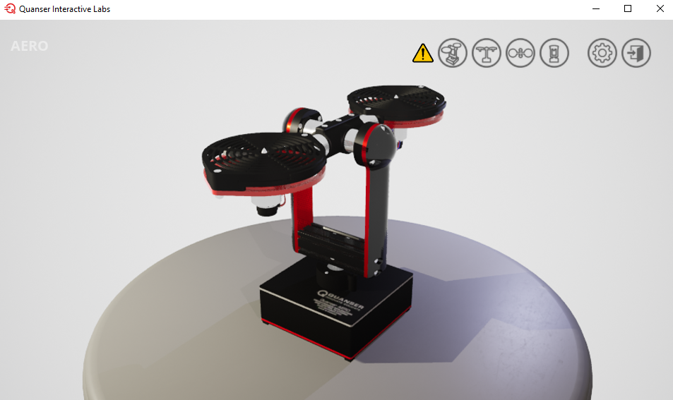
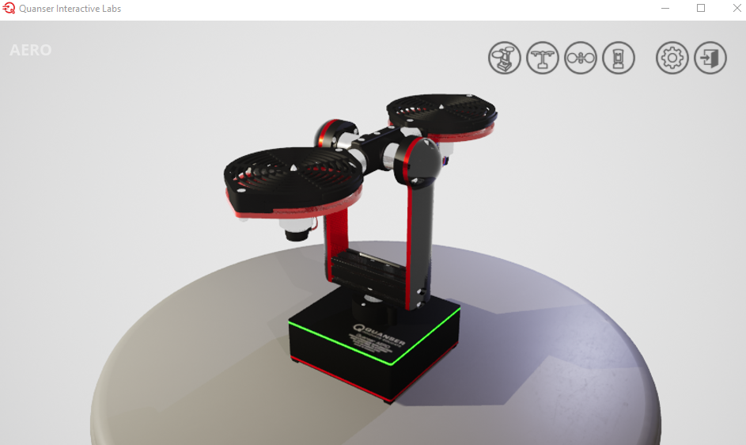

# 🧪 Guía para uso del gemelo digital Quanser Aero 

**Uso de Aero  y Simulink con QUARC**

---

## Introducción

1.  Registrarse en https://portal.quanser.com/Accounts/Login?returnUrl=/ utilizando su correo institucional
2.	Abrir Matlab, descargar e instalar el complemento Quanser interactive Labs for Matlab
   

*Figura 1: Complemento Quanser interactive labs para gemelos digitales*

---
## Lanzar la aplicación en MATLAB
1. En la ventana de comandos de MATLAB (Command Window), digite `QLabs.setup` y pulse Enter.
2. Posteriormente, digite `QLabs.launch` y pulse Enter.
3. Se abrirá una ventana emergente con la opción de abrir una de las plantas disponibles.

 
*Figura 2: Gemelos digitales disponibles para universidad ECCI*
 
4. Pulsar en el **Quanser Aero** y se abrirá otra ventana emergente con la interfaz del gemelo digital.

---
## Configuración del Modelo Simulink

1. Abre **MATLAB** y, en la ventana de comandos, escribe `simulink` para abrir un nuevo modelo en blanco (Blank QUARC Model si está disponible, si no, un Blank Model normal).
2. Abre la ventana del **Simulink Library Browser** haciendo clic en el icono correspondiente en la pestaña de Simulación.

*Figura 4: Componentes QUARC en Simulink Library Browser*

3. Expande la siguiente ruta en el navegador de librerías:  
   `QUARC Targets → Data Acquisition → Generic → Configuration`
4. Arrastra el bloque `HIL Initialize` al modelo Simulink. Este bloque es esencial para establecer la comunicación con el gemelo digital.
5. Haz doble clic en el bloque `HIL Initialize` para abrir su ventana de configuración.
6. Configura los siguientes parámetros en la pestaña **Main**:
   - **Board type**: `quanser_aero2_usb` (Seleccionar de la lista desplegable).
   - Haz clic en el botón **Defaults** para aplicar las opciones por defecto para esta planta.
   - **Board identifier**: `0@tcpip://localhost:18930`  
   - Asegúrate de que la opción **Active during normal simulation** esté marcada.
   - Haz clic en **OK** para cerrar la ventana.

 
7. En la interfaz de **Quanser Interactive Labs**, asegúrate de que el Aero  esté configurado en modo 1-DOF (pitch-only):
    a. Desbloquea el eje de pitch (inclinación).
    b. Bloquea el eje de yaw (giro).
    c. Asegúrate de que ambos rotores estén en posición horizontal.

---

## Ejecutar el Modelo

8. Para ejecutar el controlador QUARC, simplemente presiona el botón **Run** de la pestaña **Simulation** en Simulink.

9. Si la conexión y la configuración son correctas y no hay errores, la tira de LED en la base del Aero  virtual se pondrá de color **verde**.

10. El botón "Run" se convertirá en un botón "Stop". Puedes hacer clic en él en cualquier momento para detener la simulación.

---

## Acelerando el Motor DC (Thruster 0)

11. Añade el bloque `HIL Write Analog` a tu modelo. Lo encontrarás en:  
    `QUARC Targets → Data Acquisition → Generic → Immediate I/O`
12. Configúralo haciendo doble clic y marcando la opción **Active during normal simulation** en la pestaña **Main**. Este bloque enviará un voltaje al canal 0, que controla el motor del thruster 0.
13. Añade un bloque `Constant` de la librería de Simulink (`Simulink → Sources`) y conéctalo a la entrada del bloque `HIL Write Analog`.
14. Ejecuta el controlador QUARC de nuevo con el botón **Run**.
15. Haz doble clic en el bloque `Constant` y establece su valor en `1.5`. Esto aplicará 1.5V al motor. Observa cómo la hélice del thruster 0 comienza a girar en el gemelo digital.

---

