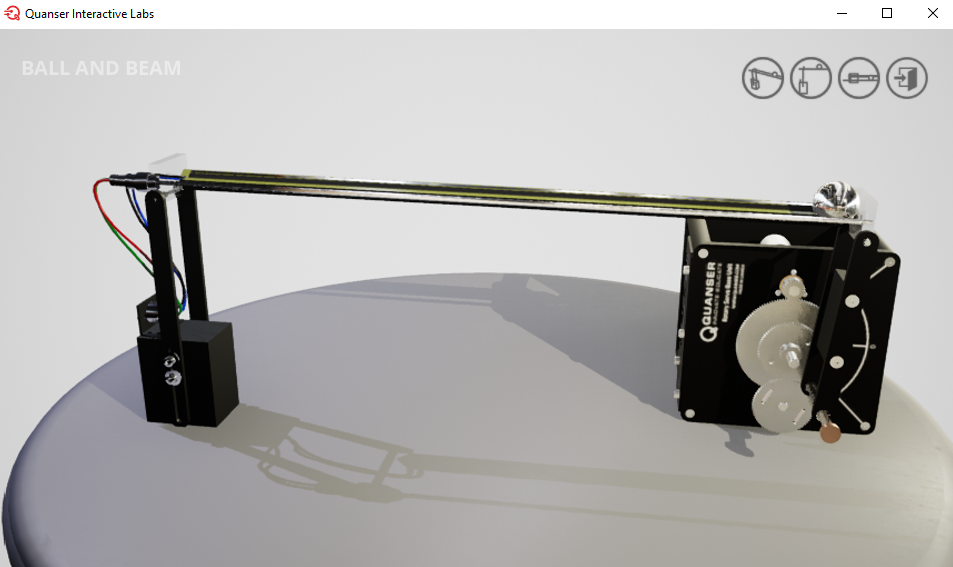

# 🧪 Guía para uso del gemelo digital Quanser Ball and Beam 

**Uso de Ball and Beam  y Simulink con QUARC**

---

## Introducción

1.  Registrarse en https://portal.quanser.com/Accounts/Login?returnUrl=/ utilizando su correo institucional
2.	Abrir Matlab, descargar e instalar el complemento Quanser interactive Labs for Matlab
   

*Figura 1: Complemento Quanser interactive labs para gemelos digitales*

---
## Lanzar la aplicación en MATLAB
1. En la ventana de comandos de MATLAB (Command Window), digite `QLabs.setup` y pulse Enter.
2. Posteriormente, digite `QLabs.launch` y pulse Enter.
3. Se abrirá una ventana emergente con la opción de abrir una de las plantas disponibles.

 
*Figura 2: Gemelos digitales disponibles para universidad ECCI*
 
4. Pulsar en el **Quanser Ball and Beam** y se abrirá otra ventana emergente con la interfaz del gemelo digital.

## Configuración del Modelo Simulink

1. Abre **MATLAB** y, en la ventana de comandos, escribe `simulink` para abrir un nuevo modelo en blanco (Blank QUARC Model si está disponible, si no, un Blank Model normal).
2. Abre la ventana del **Simulink Library Browser** haciendo clic en el icono correspondiente en la pestaña de Simulación.

*Figura 4: Componentes QUARC en Simulink Library Browser*

3. Expande la siguiente ruta en el navegador de librerías:  
   `QUARC Targets → Data Acquisition → Generic → Configuration`
4. Arrastra el bloque `HIL Initialize` al modelo Simulink. Este bloque es esencial para establecer la comunicación con el gemelo digital.
5. Haz doble clic en el bloque `HIL Initialize` para abrir su ventana de configuración.
6. Configura los siguientes parámetros en la pestaña **Main**:
   - **Board type**: `q8_usb` (Seleccionar de la lista desplegable).
   - Haz clic en el botón **Defaults** para aplicar las opciones por defecto para esta planta.
   - **Board identifier**: `0@tcpip://localhost:18942`  
   - Asegúrate de que la opción **Active during normal simulation** esté marcada.
   - Haz clic en **OK** para cerrar la ventana.

 
7. Verifica que la planta del Ball and Beam esté abierta en la aplicación **Quanser Interactive Labs**.

---

## Ejecutar el Modelo

8. Para ejecutar el controlador QUARC, simplemente presiona el botón **Run** de la pestaña **Simulation** en Simulink.

9. Si la conexión y la configuración son correctas, el modelo se ejecutará sin errores y la interfaz del gemelo digital indicará una conexión activa (generalmente el simulador responde a las entradas).

10. El botón "Run" se convertirá en un botón "Stop". Puedes hacer clic en él en cualquier momento para detener la simulación.

---

## Controlando la Viga y Leyendo la Posición de la Bola

**Inclinando la Viga (Actuación)**

11. Añade el bloque `HIL Write Analog` a tu modelo. Lo encontrarás en:  
    `QUARC Targets → Data acquisition → Generic → Immediate I/O`
12. Configúralo haciendo doble clic y marcando la opción **Active during normal simulation**. Este bloque enviará un voltaje al servo que controla el ángulo de la viga.
13. Añade un bloque `Constant` de la librería de Simulink (`Simulink → Sources`) y conéctalo a la entrada del bloque `HIL Write Analog`.
14. Ejecuta el controlador QUARC de nuevo con el botón **Run**.
15. Haz doble clic en el bloque `Constant` y establece su valor en, por ejemplo, `1.0`. Esto aplicará un voltaje que comandará un ángulo específico a la viga. Observa cómo la viga se inclina en el gemelo digital.

**Lectura de la Posición de la Bola (Medición)**

16. Añade el bloque `HIL Read Analog` a tu modelo. Se encuentra en la misma ubicación que el `HIL Write Analog`.
17. Configúralo marcando **Active during normal simulation**. Por defecto, leerá el canal de entrada analógica #0, que corresponde a la posición de la bola.
18. Conecta la salida del bloque `HIL Read Analog` a un bloque `Display` (`Simulink → Sinks`) para visualizar el valor numérico.
19. Ejecuta de nuevo el controlador. Verás que a medida que la bola se mueve a lo largo de la viga, el valor en el `Display` cambia.
> 💡 La unidad de esta medición es **metros (m)**, donde el centro de la viga es 0.

---

## Próximos Pasos

20. Ahora que puedes escribir un ángulo para la viga y leer la posición de la bola, tienes todos los elementos necesarios para cerrar el lazo de control. Puedes reemplazar el bloque `Constant` con la salida de tu controlador para regular la posición de la bola.
21. Para detener el modelo, haz clic en el botón **Stop**.
22. Cierra **Quanser Interactive Labs** cuando hayas finalizado.
