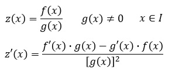

# Ejercicio Raices Reales Diferentes y Raices Reales Iguales y Explicacion de la SOLUCION RESUMIDA
De acuerdo a nuestra clase #4 vimos el tema de Raices Reales Diferentes y Raices Reales Iguales, comenzando esta clase con un ejercicio del tema y luego la explicacion y solucion del tema SOLUCION RESUMIDA.
## 1. Ejercicio Raices Reales Iguales y Raices Reales Diferentes
Se inicia la clase con el siguiente ejercicio: 

$$G(s)=\frac{2s-3}{(s+2)(s+10)^{3}}$$
ARREGLAR

Al analizar el ejercicio nos damos cuenta que es un problema que contiene raices reales diferentes e iguales a al vez, por lo cual comenzamos planteando las fracciones parciales para luego poder aplicar los dos metodos mencionados anteriormente.

Ya que el termino $(s+10)^{3}$ hace parte de raices reales iguales debemos tener en cuenta su formulacion en las fracciones parciales siendo que:  

$$ G(s)=\frac{A}{(s+2)}+\frac{B}{(s+10)^{3}}+\frac{C}{(s+10)^{2}}+\frac{D}{(s+10)}$$

Utilizamos el metodo de Raices Reales Diferentes para encontrar el valor de la variable A:

$A=\left [ \frac{(s+2)(2s-3)}{(s+2)(s+10)^{3}} \right ]\,s=-2$

$A=\left [ \frac{(-2+2)(2(-2)-3}{(-2+2)(-2+10)^{3}} \right ]\$

$A=\left [ \frac{-7}{(8)^{3}} \right]\$

$A= \frac{-7}{512}$

Ahora para la variable B usamos el metodo de Raices Reales Iguales

$$B=\left [ \frac{(s+10)^{3}(2s-3)}{(s+2)(s+10)^{3}} \right ], s=-10$$

$B=\left [ \frac{(-10+10)^{3}(2(-10)-3)}{(-10+2)(-10+10)^{3}} \right ]$

$B=\frac{-23}{8}$

$$C=\frac{d}{ds}\left [ \frac{(s+10)^{3}(2s-3)}{(s+2)(s+10)^{3}} \right ],s=-10$$

Utilizando 



Tenemos que: 

$C=\frac{d}{ds}\left [ \frac{3}{(s+5)} \right ],s=-8$

$\frac{d}{ds}(3)=0$

$\frac{d}{ds}(s+5)=1$

$C=\frac{0(s+5)-3(1)}{(s+5)^{2}},s=-8$

$C=\frac{-3}{(-8+5)^{2}}$

$C=\frac{-3}{9}=\frac{-1}{3}$

Y por ultimo paar la variable D, hacemos lo mismo, la derivada de la ecuacion anterior o la  doble derivada de la primera ecuacion:

$D=\frac{d^{2}}{ds^{2}}\left[ \frac{(s+8)^{3}3}{(s+5)(s+8)^{3}}\right],s=-8$$

$D=\left [ \frac{0(s+5)^{2}+3(2(s+5))}{(s+5)^{4}} \right ],s=-8$

$D=\left [ \frac{3(2(-8+5))}{(-8+5)^{4}} \right ]$

$D=\left [ \frac{18}{81} \right ]=\frac{-2}{9}$

Al final tendriamos que:
## 2. Solucion Resumida 
Se usa este caso cuando encontramos polinomios de segundo grado en los factores del denominador, coemnzamos con un ejercicio en clase:

$$G(s)=\frac{s^{2}+2s+3}{(s^{2}+2s+2)(s^{2}+2s+5)}$$

Primero tenemos que resolver los factores de segundo grado ya sea si es posible por metodos de factorizacion, si no por medio de la ecuacion cuadratica:

$x=\frac{-b\frac{+}{}\sqrt{b^{2}-4ac}}{2a}$

Y tenemos dos factores

### 1.1 $(s^{2}+2s+2)$
a=1 , b= 2, c=2

$x=\frac{-2 \frac{+}{}\sqrt{2^{2}-4(1)(2)}}{2(1)}$

$x=\frac{-2 \frac{+}{}\sqrt{4-8}}{2}$

$x=\frac{-2 \frac{+}{}\sqrt{-4}}{2}$

Como la raiz de -4 no existe en los numeros reales pasamos a resolver mediante numeros complejos, usando el valor de $i=\sqrt{-1}$ , quedando de tal forma:

$$x=\frac{-2\frac{+}{}\sqrt{4}i}{2}$$

$$x=-1\frac{+}{}i$$

 ### 1.2 $(s^{2}+2s+5)$

a=1, b=2 , c=5
$x=\frac{-2 \frac{+}{}\sqrt{2^{2}-4(1)(5)}}{2(1)}$

$x=\frac{-2 \frac{+}{}\sqrt{4-20}}{2}$

$x=\frac{-2 \frac{+}{}\sqrt{-16}}{2}$

Volvemos a usar el termino de i

$$x=\frac{-2\frac{+}{}\sqrt{16}i}{2}$$

$$x=-1\frac{+}{}2i$$

Teniendo estos factores separamos en fracciones parciales de la siguiente forma: 

$$G(s)=\frac{As+B}{(s^{2}+2s+2)}+\frac{Cs+D}{s^{2}+2s+5}$$

Y escribimos igualando las dos ecuaciones:

$$G(s)=\frac{s^{2}+2s+3}{(s^{2}+2s+2)(s^{2}+2s+5)}=\frac{As+B}{(s^{2}+2s+2)}+\frac{Cs+D}{s^{2}+2s+5}$$

Multiplicamos uno de los factores de segundo orden, elegimos el factor de $(s^{2}+2s+2)$ y evaluando s en los resultados de la solucion de la cuadratica quedando de tal manera:

$\left [ G(s)=\frac{(s^{2}+2s+2)(s^{2}+2s+3)}{(s^{2}+2s+2)(s^{2}+2s+5)}=\frac{(s^{2}+2s+2)As+B}{(s^{2}+2s+2)}+\frac{(s^{2}+2s+2)Cs+D}{s^{2}+2s+5} \right ] s=1+j$

Simplificamos terminos reemplazando por el valor de s, quedando de tal manera: 

$G(s)=\frac{(s^{2}+2s+3)}{(s^{2}+2s+5)}={As+B}+(0)$

$G(s)=\frac{((1+j-j^{2})+2(1+j)+3)}{(1+j-j^{2})+2(1+j)+5)}={A(1+j)+B}$

$G(s)=\frac{((1+j)^{2}+2(1+j)+3)}{((1+j)^{2}+2(1+j)+5)}={A(1+j)+B}$

Y resolvemos multiplicaciones

$G(s)=\frac{1+j-j^{2}+2+2j+3}{1+j-j^{2}+2+2j+5}={A+Aj+B}$

$G(s)=\frac{1+j-1+2+2j+3}{1+j-j+2+2j+5}={A+Aj+B}$
Teniendo en cuenta que $j^{2}=-1$ tendriamos que: 


Se resuelven la suma de cuadrados quedando

$$


## 2. Definiciones
Utilice el símbolo '>' para crear bloques de texto. En la presente plantilla estas cajas están reservadas para resaltar las definiciones, las cuales deben ser breves, y la palabra o frase que se está definiendo debe estar en letra itálica. El inicio del bloque de texto debe realizarse con el emoji 🔑 .
>🔑 *Definición:* descripción precisa y clara del significado de una palabra, término, concepto o fenómeno. Es una explicación que establece los límites y el alcance de aquello que se está definiendo, aclarando su naturaleza, características esenciales y, en algunos casos, su relación con otros conceptos.

## 3. Subsecciones
Las subsecciones pueden utilizarse para sub dividir ciertos temas que se tienen en clases, por ejemplo si se está trabajandolos conversores D/A, puede ser necesario subdividir este en circuito de resistencias ponderadas y circuito de escalera R2R. 
### 3.1. Título de subsecciones
Para la creación de estas subsecciones debe utilizar un tamaño de letra más pequeño, por lo tanto utilice la etiqueta '###' 
### 3.2. Numeración de subsecciones
Siga la numeración de la sección seguida de un punto y luego el número de la subsección.

## 4. Ejemplos
Si en algún caso pretende dar un ejemplo explicativo ya sea a través de texto o através de ecuaciones matemáticos, utilizar la palabra 'Ejemplo' seguido de una numeración consecutiva dentro de la clase. Utilice el emoji 💡 antecediendo la palabra.

## 5. Ecuaciones
Para la edición de ecuaciones debe utilizar la etiqueta '$$' al comienzo y final de la ecuación para que la ecuación quede centrada ocupando una línea. Si se quiere que la ecuación quede integrada en el texto debe utilizar la etiqueta '$' al comienzo y final de la ecuación. Las ecuaciones pueden ser editadas utilizando el código LATEX, en el siguiente enlace encuentran un editor de ecuaciones que les genera el código. http://www.alciro.org/tools/matematicas/editor-ecuaciones.jsp . Sin embargo hay muchas otras herramientas que pueden utilizar para esto.

💡**Ejemplo 1:** si se va a representar la ecuación de la ley de Ohm se puede mostrar así $R=\frac{V}{I}$ o también,

$$R=\frac{V}{I}$$

## 6. Figuras
Todas las figuras que incluya deben ser generadas por ustedes, **no utilizar las figuras de las presentaciones**. Para incluir figuras puede seguir los siguientes pasos:
* Primero escribimos .
* Después escribimos, dentro de los corchetes, el texto alternativo. Este es opcional y solo entra en acción cuando no se puede cargar la imagen correctamente.
* Después escribimos, dentro de los paréntesis, la ubicación del archivo (ya sea una url o una ubicación dentro de algun folder local). Se recomienda poner las imágenes en una carpeta que se llame imágenes dentro del repositorio github para que no tengan problemas al cargar las imágenes.

💡**Ejemplo 2:**


Figura 1. Figura de prueba

Incluya la respectiva etiqueta a modo de descripción de la figura y mantenga numeración consecutiva para todas las figuras de la clase.

## 7. Tablas
En caso de necesitar la inclusión de tablas para organizar información se recomienda el uso de la herramienta del siguiente enlace https://www.tablesgenerator.com/markdown_tables , la cual permite organizar la información dentro de la tabla y genera el código markdown automáticamente:

💡**Ejemplo 3:** 

| **Resultado** | **x = número de intentos hasta primer éxito** |
|---------------|-----------------------------------------------|
|       S       |                       1                       |
|       FS      |                       2                       |
|      FFS      |                       3                       |
|      ...      |                      ...                      |
|    FFFFFFS    |                       7                       |
|      ...      |                      ...                      |

Tabla 1. Tabla de ejemplo

Cada tabla debe llevar la etiqueta que describa su contenido y numeración consecutiva para todas las tablas

## 8. Código
Teniendo en cuenta que el curso requiere del desarrollo de código matlab, c, c++ u otro. Si requiere incluir pequeños segmentos de código en los apuntes hágalos de la siguiente manera:

💡**Ejemplo 4:**
```
var sumar2 = function(numero) {
  return numero + 2;
}
```

## 9. Ejercicios
Deben agregar 2 ejercicios con su respectiva solución, referentes a los temas tratados en cada una de las clases. Para agregar estos, utilice la etiqueta #, es decir como un nuevo título dentro de la clase con la palabra 'Ejercicios'. Cada uno de los ejercicios debe estar numerado y con su respectiva solución inmediatamente despues del enunciado. Antes del subtitulo de cada ejercicio incluya el emoji 📚

## Rúbrica
| 0-1                                                                                   | 1-2                                                                                  | 2-3                                                                                                                                                                               | 3-4                                                                                                                                                                       | 4-5                                                                                                                                                                               |
|---------------------------------------------------------------------------------------|--------------------------------------------------------------------------------------|-----------------------------------------------------------------------------------------------------------------------------------------------------------------------------------|---------------------------------------------------------------------------------------------------------------------------------------------------------------------------|-----------------------------------------------------------------------------------------------------------------------------------------------------------------------------------|
| Presenta menos del 10% de los temas o no presenta por  el medio y formato  solicitado | Presenta menos del 40% de los temas solicitados, y  cumple parcialmente la plantilla | Presenta menos del 60% de los temas solicitados (con descripciones, gráficos tablas, etc), y cumple  parcialmente la plantilla. No presenta la totalidad  de ejercicios resueltos | Presenta menos del 80% de los temas solicitados (con descripciones, gráficos, tablas, etc) y cumple con  la plantilla. No presenta  la totalidad de ejercicios  resueltos | Presenta el 100% de los temas vistos en clase (con descripciones, gráficos, tablas, etc), siguiendo totalmente la plantilla. presenta la  totalidad de los ejercicios solicitados |

## 10. Conclusiones
Agregue unas breves conclusiones sobre los temas trabajados en cada clase, puede ser a modo de resumen de lo trabajado o a indicando lo aprendido en cada clase

## 11. Referencias
Agregue un subtítulo al final donde pueda poner todas las referencias consultadas incluyendo el origen o fuente de los ejercicios planteados. Tambien dentro del texto referencie los textos o artículos consultados y las figuras y tablas dentro de la explicación de las mismas.
